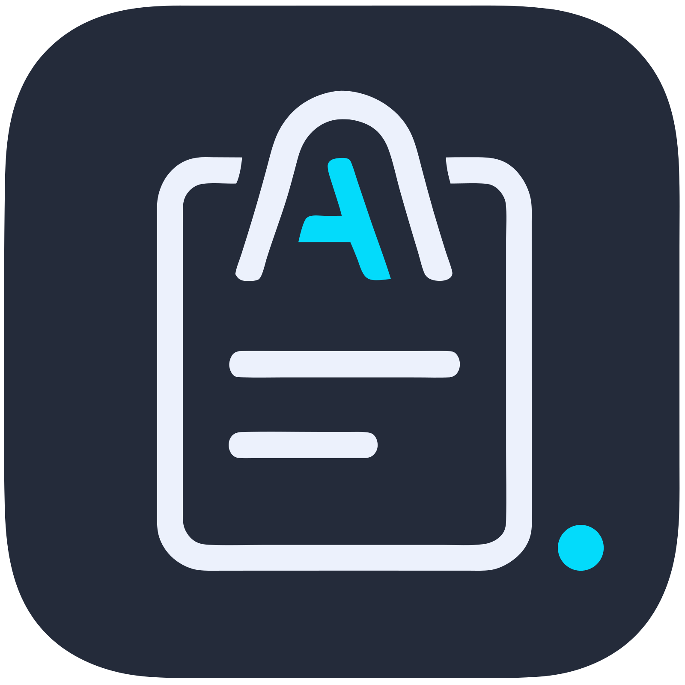

<h1>ContextNow!</h1>

<strong>你的 AI 第二大脑。</strong>

<a href="https://www.contextnow.tech">https://www.contextnow.tech</a>

<i>停止对 AI 重复输入！ContextNow 是一款为你 AI 打造的专属记忆中枢，让你能随时保存、分析，并一键注入上下文。让工作更流畅，让 AI 更懂你。</i>

---

**[English](README.md) · 中文版本**

AI 时代最宝贵的资产是“上下文”（Context）。但这些上下文却分散在无数的浏览器标签、聊天窗口和文档之中。**ContextNow 正是为了解决这一痛点而生。**

它不止是又一个剪贴板管理器或静态的提示词库；它是为你整个 AI 工作流打造的动态记忆核心。你可以用它毫不费力地保存关键信息，将它们组织成不断进化的“上下文包”，并注入到任何 AI 对话中，甚至可以自动增强你的提示词。让 AI 能即刻理解你的世界，为你节省无数重复解释和复制粘贴的时间。

### ✨ 关键特性

#### 🚀 **1. 一键注入上下文**
* **从想法到提示词，只需一秒。**
* 使用可自定义的全局快捷键，瞬间唤出你的上下文库。选择所需内容，即可粘贴到当前应用。这感觉就像魔法，但背后是纯粹的效率。

#### 🧠 **2. 智能上下文管理**
* **你的上下文，从此更智能、永不过时。**
* 不只是保存，更是进化。ContextNow 能智能地将新信息合并到现有上下文中，为你总结长对话，并通过标签和分组帮你整理一切。它能将你零散的笔记，转化为一个结构化、可随时取用的知识库。

#### 📥 **3. 轻松导入**
* **随时随地，即时捕捉上下文。**
* 通过全局快捷键，无需切换窗口即可添加上下文。你也可以直接导入文件，在几秒钟内建立起你的知识库。我们让信息导入变得无比简单，让你能花更少时间管理，更多时间创造。

#### 🪄 **4. 智能提示词增强 (即将上线)**
* **用上下文为你的提示词注入超级动力。**
* 在你发送提示词之前，ContextNow 会智能扫描你已保存的上下文，找到相关的项目规格、用户数据或代码依赖，并自动增强你原有的问题。这就像有一位专属的提示词工程师，全天候待命。

#### 🔒 **5. 隐私优先，本地存储**
* **你的数据，只属于你。**
* 我们坚信，你的上下文是你的知识产权。ContextNow 将所有数据安全地存储在你的本地设备上。没有云端，没有服务器，没有窥探。一切由你掌控。

### 🚀 开始使用

1.  **下载应用：**
    * [**即将发布**](https://apps.apple.com/app/ContextNow)
2.  **访问我们的网站：**
    * [**www.contextnow.tech**](https://www.contextnow.tech)

### 💬 社区与反馈

我们期待你的声音！
* **功能请求与 Bug 报告：** 请通过 [**GitHub Issues**](https://github.com/Context-Now/ContextNow/issues) 提交。
* **讨论与交流：** 加入我们的 [**Discord 服务器 (即将开放)**](https://discord.gg/ContextNow)，与开发团队和其他用户交流。
* **在 X (Twitter) 上关注我们 (即将启用)：** 关注 [@ContextNow](https://x.com/ContextNow) 获取最新动态。